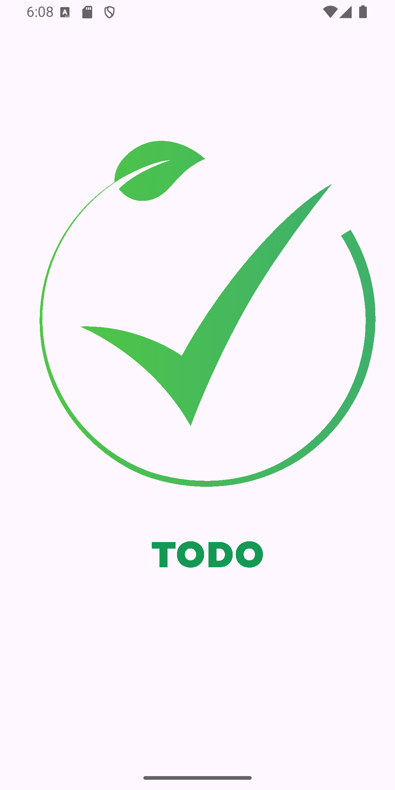
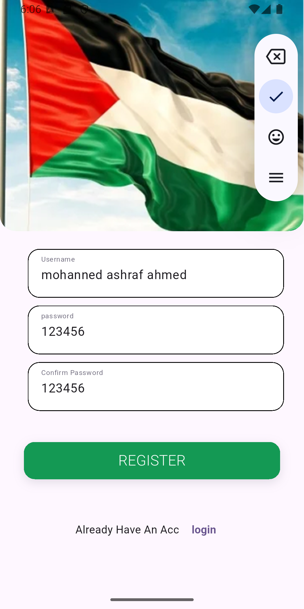
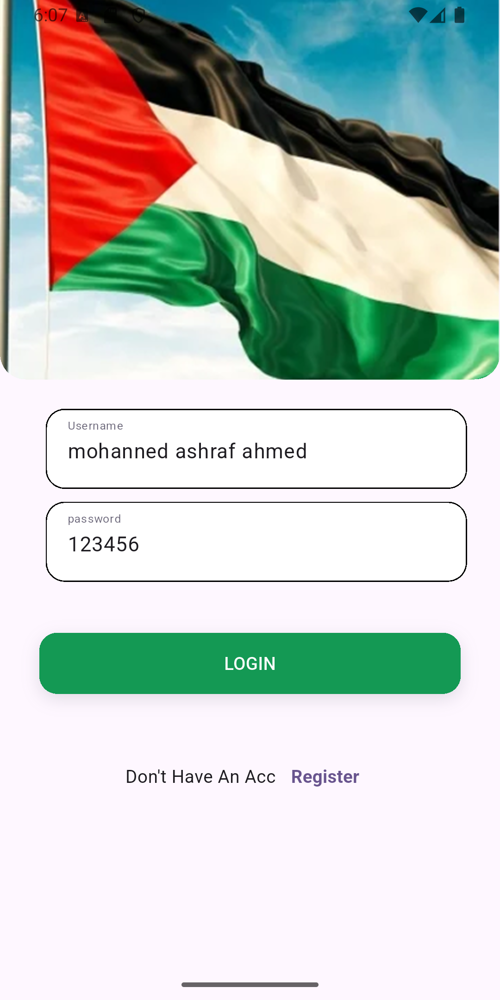
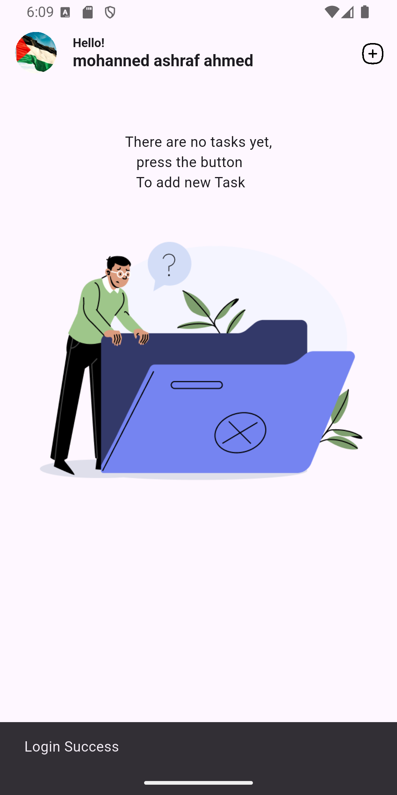

# to_do_app

🚀 **A simple and efficient task management app built with Flutter.**  

## 📌 Features  
- 📝 Add, edit, and delete tasks  
- 📆 Set due dates and reminders  
- 🌙 Light & Dark mode support  
- 🔄 Sync tasks across devices (Future update)
  
## 📸 Preview  
### 🖼 Screenshots  
  

  

  

 

### 📽 Demo Video  

